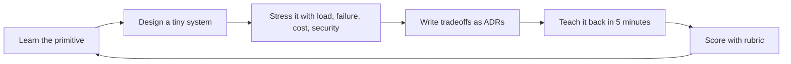

# Systems Design Speedrun

A practical repo for learning systems design fast by compressing the field into:

1. **Maps** — skill trees, diagrams, and concept dependency graphs.
2. **Moves** — repeatable design patterns and tradeoff heuristics.
3. **Drills** — short design katas with rubrics.
4. **Artifacts** — design docs, ADRs, SLOs, postmortems, and review notes.
5. **Feedback loops** — self-review, peer review, and teach-back.

The goal is not to memorize every distributed systems paper. The goal is to become useful quickly: define requirements, sketch an architecture, identify bottlenecks, reason about tradeoffs, and explain failure modes.

## Fast path

Start here:

- [Speedrun map](docs/roadmap/00-speedrun-map.md)
- [7-day core sprint](docs/roadmap/01-7-day-core.md)
- [30-day interview + production sprint](docs/roadmap/02-30-day-interview-production.md)
- [90-day builder path](docs/roadmap/03-90-day-builder.md)
- [One-page design template](docs/artifact-templates/one-page-design-template.md)
- [Design review rubric](docs/artifact-templates/design-review-rubric.md)

## Recommended loop

Use this loop for every topic and every design kata:

## What you should be able to do after the speedrun

After the 7-day sprint, you should be able to discuss the common building blocks and sketch simple designs. After 30 days, you should be able to handle most interview-style systems design prompts and make reasonable production tradeoffs. After 90 days, you should have a portfolio of build projects and design docs.

## Repo philosophy

- Prefer **decision quality** over buzzword recall.
- Prefer **failure-mode thinking** over happy-path diagrams.
- Prefer **small artifacts** over giant notes.
- Prefer **repeatable drills** over passive videos.
- Prefer **public, authoritative resources** over random lists.

## Canonical public resources

- Google SRE books: https://sre.google/books/
- AWS Well-Architected: https://aws.amazon.com/architecture/well-architected/
- Azure Architecture Center patterns: https://learn.microsoft.com/en-us/azure/architecture/patterns/
- C4 model: https://c4model.com/
- Architecture Decision Records: https://adr.github.io/
- MIT 6.5840 Distributed Systems: https://pdos.csail.mit.edu/6.824/
- OpenTelemetry: https://opentelemetry.io/docs/what-is-opentelemetry/

## How to use this repo to speedrun any knowledge domain

The same structure works outside systems design:

1. Create a skill tree.
2. Identify the 20% of concepts that unlock 80% of practice.
3. Write one-page explainers.
4. Create drills that force active recall and synthesis.
5. Add rubrics that reveal gaps.
6. Record decisions and tradeoffs.
7. Teach back publicly.

See [Knowledge speedrun method](docs/roadmap/99-knowledge-speedrun-method.md).
