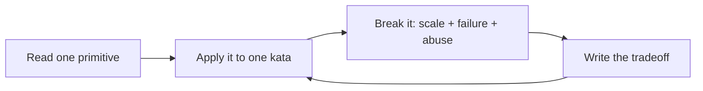

# Systems Design Speedrun

An opinionated, drill-based path for getting useful at systems design quickly.

This repo is not a generic “learn anything” template. It is a systems-design workout plan built around the recurring moves that show up in interviews and production design reviews:

1. **Frame the product** — users, use cases, non-goals, and hard constraints.
2. **Put numbers on it** — QPS, fanout, storage, bandwidth, cache size, partitions.
3. **Model the data and APIs** — entities, access patterns, indexes, consistency boundaries.
4. **Choose the baseline architecture** — request path, async path, storage, cache, queues, workers.
5. **Break the design on purpose** — hot keys, thundering herds, partial failure, retry storms, data loss, abuse, cost.
6. **Defend tradeoffs** — why this design, why not the obvious alternative, what changes at 10x.

## Start here: the direct outline

If you have one week, follow this exact order:

1. [Speedrun map](docs/roadmap/00-speedrun-map.md) — the mental model and skill tree.
2. [Systems design playbook](docs/concepts/systems-design-playbook.md) — the reusable design moves.
3. [Concrete resource map](docs/resources/concrete-resource-map.md) — what to read/watch/build first.
4. [7-day core sprint](docs/roadmap/01-7-day-core.md) — daily drills with deliverables.
5. [URL shortener kata](docs/drills/url-shortener.md) — first full pass.
6. [Design review rubric](docs/artifact-templates/design-review-rubric.md) — score the design and find gaps.

Then repeat with:

- [Rate limiter](docs/drills/rate-limiter.md)
- [News feed](docs/drills/news-feed.md)
- [Chat](docs/drills/chat.md)
- [Webhook platform](docs/drills/webhook-platform.md)
- [Metrics ingestion](docs/drills/metrics-ingestion.md)

## The simplified loop

Use this for every concept and kata:

Short version: **learn one move, use it, break it, explain the tradeoff.**

## What makes this systems-design-specific

The repo is organized around systems design pressure tests, not passive notes:

- **Numbers before architecture:** every serious design should include rough QPS, storage, bandwidth, and cache math.
- **Access patterns before databases:** pick storage by queries, writes, indexes, durability, and consistency needs.
- **Request path vs async path:** identify what must happen inline and what can move to queues/workers/streams.
- **Hot path vs cold path:** optimize the common path without losing operational repair paths.
- **Failure-mode thinking:** every design should name dependency failures, retries, backpressure, data loss risks, and user-visible impact.
- **Abuse and cost:** rate limits, quotas, bot behavior, noisy neighbors, and runaway spend are first-class design constraints.
- **Tradeoff defense:** design docs should say what was rejected and what changes at 10x scale.

## What you should be able to do after the speedrun

After 7 days, you should be able to run a complete systems design conversation from requirements to tradeoffs. After 30 days, you should be able to handle common interview prompts and write pragmatic one-page designs. After 90 days, you should have a portfolio of build projects, ADRs, postmortems, and reviewed designs.

## Canonical public resources

Use the [concrete resource map](docs/resources/concrete-resource-map.md) for the recommended order. Core references include:

- Google SRE books: https://sre.google/books/
- AWS Well-Architected: https://aws.amazon.com/architecture/well-architected/
- Azure Architecture Center patterns: https://learn.microsoft.com/en-us/azure/architecture/patterns/
- C4 model: https://c4model.com/
- Architecture Decision Records: https://adr.github.io/
- MIT 6.5840 Distributed Systems: https://pdos.csail.mit.edu/6.824/
- OpenTelemetry: https://opentelemetry.io/docs/what-is-opentelemetry/

## Contributing

Good contributions add systems-design leverage: a sharper drill, a concrete calculation, a production failure mode, a tradeoff table, a solved kata, or an authoritative resource tied to a specific concept.
