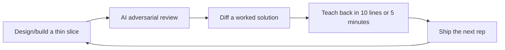

# Systems Design Speedrun

**Start here:** [do your first systems design rep in 30 minutes](START-HERE.md).

A build-first, teach-first systems design speedrun for people who want to start today.

This is not a reasonable study plan. It is an expertise-compression protocol: build a small system, break it on purpose, explain the tradeoff, compare against expert references, then ship the next version.

## The product is the loop

Short version: **build, review, diff, teach, ship again.**

Reading is not the first step. Reading is ammunition for the system you are already building.

## Fast path

One door in:

1. [START-HERE.md](START-HERE.md) — 25-minute URL shortener rep.
2. [AI design-review prompt](prompts/design-review-prompt.md) — get an adversarial review immediately.
3. [Worked URL shortener solution](docs/drills/solutions/url-shortener.md) — diff against a reference answer.
4. [7-day core sprint](docs/roadmap/01-7-day-core.md) — repeat daily with built-in revisits.
5. Track your own reps in `docs/drills/solutions/`.

After that, repeat with:

- [Rate limiter](docs/drills/rate-limiter.md) → [worked solution](docs/drills/solutions/rate-limiter.md)
- [News feed](docs/drills/news-feed.md)
- [Chat](docs/drills/chat.md)
- [Webhook platform](docs/drills/webhook-platform.md)
- [Metrics ingestion](docs/drills/metrics-ingestion.md)

## What makes this systems-design-specific

The repo is organized around systems design pressure tests, not passive notes:

- **Numbers before architecture:** every serious design should include rough QPS, storage, bandwidth, and cache math.
- **Access patterns before databases:** pick storage by queries, writes, indexes, durability, and consistency needs.
- **Request path vs async path:** identify what must happen inline and what can move to queues/workers/streams.
- **Hot path vs cold path:** optimize the common path without losing operational repair paths.
- **Failure-mode thinking:** every design should name dependency failures, retries, backpressure, data loss risks, and user-visible impact.
- **Abuse and cost:** rate limits, quotas, bot behavior, noisy neighbors, and runaway spend are first-class design constraints.
- **Tradeoff defense:** design docs should say what was rejected and what changes at 10x scale.

## What you should be able to do after the speedrun

After day zero, you should have a running toy system plus a design note. After 7 days, you should have 5-7 shipped reps: small systems or major revisions, each with pressure tests, tradeoffs, and teach-backs. After 30 days, you should have a public portfolio of systems, incident-style writeups, ADRs, and expert-comparison notes.

The aim is not to become “interview ready.” The aim is to compress the distance between naive builder and serious systems thinker as aggressively as possible.

## Canonical public resources

Use the [concrete resource map](docs/resources/concrete-resource-map.md) for the recommended order. Core references include:

- Designing Data-Intensive Applications: https://dataintensive.net/
- Google SRE books: https://sre.google/books/
- AWS Builders Library: https://aws.amazon.com/builders-library/
- Jepsen analyses: https://jepsen.io/analyses
- AWS Well-Architected: https://aws.amazon.com/architecture/well-architected/
- C4 model: https://c4model.com/
- Architecture Decision Records: https://adr.github.io/
- MIT 6.5840 Distributed Systems: https://pdos.csail.mit.edu/6.824/
- OpenTelemetry: https://opentelemetry.io/docs/what-is-opentelemetry/

## Contributing

Good contributions add systems-design leverage: a sharper drill, a concrete calculation, a production failure mode, a tradeoff table, a solved kata, an AI-review improvement, or an authoritative resource tied to a specific concept.

This structure can generalize beyond systems design, but v1 is focused here: build systems, break systems, explain systems.
