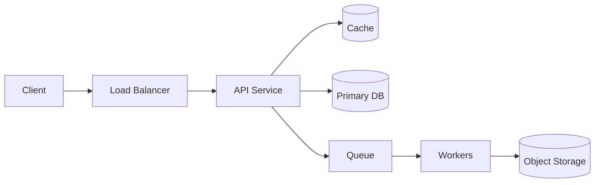

# One-Page System Design Template

## 1. Problem

What are we building, for whom, and why?

## 2. Requirements

Functional:

- 

Non-functional:

- Latency:
- Availability:
- Consistency:
- Durability:
- Security/privacy:
- Cost:

Non-goals:

- 

## 3. Assumptions and estimates

| Metric | Estimate | Reasoning |
|---|---:|---|
| DAU |  |  |
| Read QPS |  |  |
| Write QPS |  |  |
| Storage/day |  |  |
| Peak multiplier |  |  |

## 4. API sketch

```http
METHOD /path
```

## 5. Data model

| Entity | Key fields | Access patterns |
|---|---|---|
|  |  |  |

## 6. Architecture



## 7. Scaling plan

- Read path:
- Write path:
- Hot keys:
- Large objects:
- Multi-region:

## 8. Failure modes

Every design needs this section. Do not move on until at least five realistic failures are named.

| Failure | Trigger | User impact | Detection | Mitigation/recovery |
|---|---|---|---|---|
|  |  |  |  |  |

## 9. Observability

- SLIs:
- Alerts:
- Logs:
- Traces:
- Dashboards:

## 10. Tradeoffs and alternatives

Decision:

Alternatives considered:

Why this choice:

What changes at 10x:

## 11. Teach-back

Write 10 lines or record a 5-minute explanation:

- What the system does:
- What the hardest constraint is:
- What breaks first:
- What tradeoff you chose:
- What you would revisit next:

## 12. Review loop

- AI review completed:
- Worked solution diff completed:
- Weakest section rewritten:
- Principle to remember next time:
