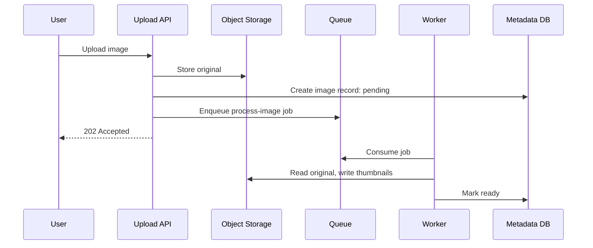

# Queues, Streams, and Async Work

Async architecture removes slow or unreliable work from the request path.

## Queue vs stream

- **Queue**: work distribution; each message usually processed by one consumer.
- **Stream**: ordered event log; multiple consumers can independently read the same event history.

## Use a queue when

- Work can happen later
- You need retries
- You need to smooth traffic spikes
- Workers can scale independently
- The request path should be fast

## Use a stream when

- Multiple consumers need the same event
- Event history matters
- Ordering by key matters
- You need replay
- You are building data pipelines or event-sourced flows

## Design checklist

- Message schema
- Ordering guarantee
- Idempotency key
- Retry policy
- Dead-letter queue
- Visibility timeout or lease
- Backpressure behavior
- Poison message handling
- Consumer scaling
- Monitoring: lag, failure rate, processing latency

## Example: image upload

## Idempotency rule

Every retried operation should be safe to run more than once, or it should detect duplicates.

## Recall questions

What work should move off the request path?
Slow, retryable, non-critical, fanout, analytics, notification, and enrichment work.

What does a queue usually force you to handle?
Retries, duplicate delivery, idempotency, backlog, poison messages, and observability.

When is a stream better than a queue?
When consumers need replayable ordered history or multiple independent consumers.

Why do retries cause outages?
They can amplify load on an already failing dependency unless bounded with backoff/jitter.

What should every async design define?
Delivery semantics, retry policy, DLQ behavior, idempotency key, ordering needs, and replay plan.

