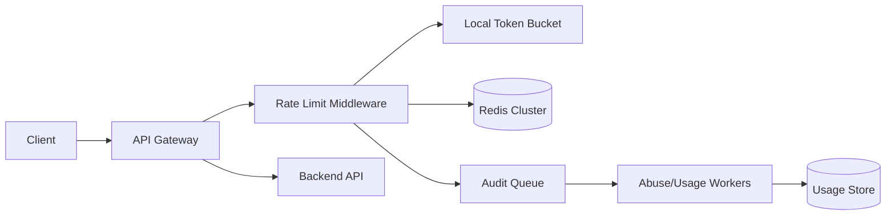

# Worked Solution: Rate Limiter

This is a reference design to diff against after your own attempt.

## 1. Problem

Build a rate limiter for an API platform. It should protect services, enforce quotas, and remain fast enough to sit on the request path.

## 2. Requirements

Functional:

- Limit requests by API key/user/IP/tenant.
- Support per-minute and per-day quotas.
- Return allow/deny plus retry-after metadata.
- Support burst tolerance.
- Provide basic quota usage visibility.

Non-functional:

- Decision latency should be very low, target p95 under 5 ms inside the infrastructure.
- Must work across multiple API servers.
- Must fail safely during datastore issues.
- Must handle abusive clients and hot tenants.

Non-goals:

- Perfect global fairness in v1.
- Billing-grade exact usage accounting.
- Complex per-endpoint policies in first version.

## 3. Assumptions and estimates

| Metric | Estimate | Reasoning |
|---|---:|---|
| API requests/sec | 50k average, 250k peak | shared public API |
| Tenants | 100k | long tail plus hot tenants |
| Hot tenant peak | 20k req/sec | abusive or large customer |
| Decision budget | <5 ms p95 | limiter is on critical path |
| Counter TTL | 1-2 windows | expire inactive keys |

The first bottleneck is centralized limiter state under high request volume and hot keys.

## 4. API sketch

Internal check:

```http
POST /rate-limit/check

{
  "subject": "tenant:123",
  "policy": "default-api",
  "cost": 1
}
```

Response:

```json
{
  "allowed": true,
  "remaining": 42,
  "reset_at": "2026-07-01T21:00:00Z",
  "retry_after_seconds": 0
}
```

In many deployments this is not a network API. It is middleware or a sidecar to avoid extra hops.

## 5. Data model

| Entity | Key fields | Access patterns |
|---|---|---|
| Policy | policy_id, limit, window, burst | read policy by endpoint/tenant |
| Counter | subject, policy_id, window_start, count | increment/check on every request |
| TenantOverride | tenant_id, policy_id, custom_limit | read on policy resolution |
| AuditEvent | subject, decision, timestamp, reason | async abuse/debug analysis |

Storage choice:

- Redis is a common first choice for shared low-latency counters.
- Use atomic increment/Lua script for check-and-increment.
- Local in-process token buckets can absorb microbursts but need shared backing for global quotas.

## 6. Architecture



Request path:

1. Resolve subject: API key, user, tenant, or IP.
2. Resolve policy.
3. Check local burst bucket if configured.
4. Atomically increment shared counter for the current window.
5. Allow if under limit; deny with `429` and `Retry-After` if over.
6. Emit audit/usage event asynchronously.

## 7. Algorithm choice

Good v1: fixed window plus small burst bucket.

Why:

- Simple and fast.
- Easy to explain and operate.
- Good enough for many API quotas.

Downside:

- Boundary bursts can allow roughly 2x the intended rate around window edges.

Upgrade paths:

- Sliding window log: more precise, more memory.
- Sliding window counter: smoother, approximate.
- Token bucket: great for burst control.
- Leaky bucket: smooths request rate, can add queuing delay.

## 8. Scaling plan

Hot tenants:

- Hot counter keys can overload one Redis shard.
- Split extremely hot tenants into sub-counters and aggregate approximately.
- Apply local pre-limits before shared counter for obvious abuse.

Multiple regions:

- Exact global rate limits across regions require coordination and latency.
- Prefer regional quotas plus lower per-region limits for v1.
- Use async aggregation for global visibility.

Failure behavior:

- Fail-open for low-risk user traffic if limiter datastore is briefly unavailable.
- Fail-closed for abusive tenants, expensive endpoints, login attempts, or write-heavy actions.
- Make fail mode explicit per policy.

## 9. Failure modes

| Failure | User impact | Mitigation |
|---|---|---|
| Redis slow/unavailable | limiter adds latency or cannot decide | timeout quickly, policy-based fail-open/fail-closed, local fallback |
| Hot key | one tenant overloads Redis shard | local pre-limit, key splitting, dedicated policy for tenant |
| Clock skew | incorrect window reset | use Redis/server time for shared decisions |
| NAT/shared IP | legitimate users throttled | prefer API key/user over IP; IP only as coarse abuse signal |
| Identifier rotation | attackers bypass limits | combine signals: account, IP range, device, payment, behavior |
| Boundary burst | too many requests at window edge | token bucket or sliding window counter |
| Duplicate audit events | noisy reporting | async usage is approximate; billing needs separate pipeline |

## 10. Observability

SLIs:

- Rate-limit decision latency.
- Redis latency and error rate.
- Allowed/denied request counts by policy.
- Fail-open/fail-closed counts.
- Hot key/tenant distribution.

Alerts:

- Limiter latency threatens API latency budget.
- Redis errors cause fail-open spike.
- One tenant dominates denied or allowed traffic.
- Unexpected drop in denied traffic during known abuse.

## 11. Tradeoffs and alternatives

Decision: Redis-backed fixed window with local burst bucket.

Why:

- Fast enough for request path.
- Atomic shared counters across app servers.
- Simple operational model for v1.

Alternative: exact sliding log.

Pros:

- More precise; no boundary burst.

Cons:

- Higher memory and write load.
- Harder to operate for very high QPS.

Revisit if:

- Boundary bursts are exploited.
- Customers need smoother fairness.
- Quota enforcement becomes billing-grade.

## Expert diff prompts

After your own design, compare:

- Did you define the fail-open/fail-closed policy?
- Did you handle shared state across API servers?
- Did you name the hot-key problem?
- Did you distinguish abuse limits from paid quotas?
- Did your algorithm choice match the precision requirement?

## Teach-back

This design keeps rate-limit decisions on the request path, so latency matters more than perfect precision. Redis provides shared atomic counters across API servers, while a local token bucket absorbs bursts and protects Redis from obvious abuse. The main tradeoff is approximate fairness: fixed windows can over-allow at boundaries, and regional limits are not perfectly global. That is acceptable for v1 unless quotas are billing-grade or abuse is exploiting the approximation.
