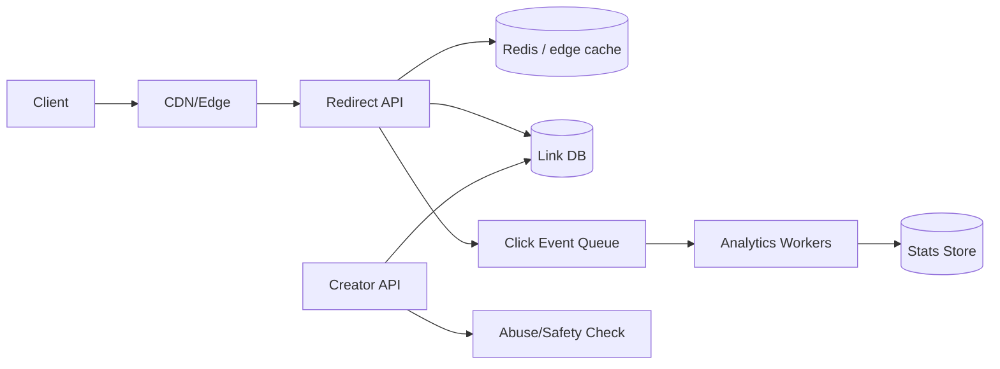

# Worked Solution: URL Shortener

This is not the only correct answer. It is a reference design to diff against after your own attempt.

## 1. Problem

Build a URL shortener that creates short links, redirects users quickly, and records basic analytics.

## 2. Requirements

Functional:

- Create a short slug for a long URL.
- Redirect `/{slug}` to the original URL.
- Support custom aliases when available.
- Track click counts and basic dimensions like timestamp, referrer, country, device.
- Allow link owner to disable/delete a link.

Non-functional:

- Redirect path should be very low latency, target p95 under 50 ms excluding network.
- Redirects are read-heavy and may have extreme hot keys.
- Slug creation must avoid collisions.
- Analytics may be eventually consistent.
- Abuse controls are required for spam/malware links.

Non-goals:

- Full marketing analytics suite.
- Perfect real-time analytics.
- User-facing custom domains in v1.

## 3. Assumptions and estimates

| Metric | Estimate | Reasoning |
|---|---:|---|
| New links/day | 1M | public consumer service |
| Redirects/day | 1B | read-heavy, 1000:1 read/write |
| Average redirect QPS | ~11.6k | 1B / 86,400 |
| Peak redirect QPS | ~100k | ~10x peak multiplier |
| Metadata/link | ~1 KB | URL, owner, timestamps, flags |
| Storage/year | ~365 GB raw metadata | 1M/day * 365 * 1 KB |
| Analytics events/day | 1B | one event per redirect |

The first bottleneck is the redirect hot path, not link creation.

## 4. API sketch

```http
POST /links
Content-Type: application/json

{
  "url": "https://example.com/long/path",
  "custom_slug": "optional"
}
```

```http
GET /{slug}
302 Location: https://example.com/long/path
```

```http
GET /links/{slug}/analytics?from=...&to=...
```

## 5. Data model

| Entity | Key fields | Access patterns |
|---|---|---|
| Link | slug, long_url, owner_id, created_at, disabled_at, safety_status | lookup by slug, list by owner |
| ClickEvent | slug, timestamp, referrer, country, device | append on redirect, aggregate async |
| LinkStats | slug, bucket_start, clicks, uniques-ish | read analytics by slug/time bucket |
| AbuseRecord | url_hash, slug, verdict, reason | block known bad URLs/slugs |

Storage choice:

- Primary link metadata can start in PostgreSQL with unique index on `slug`.
- At larger scale, move slug lookup to a key-value store or heavily cached read path.
- Analytics events go to a queue/stream, then workers aggregate into time buckets.

## 6. Architecture



Redirect path:

1. Client requests `GET /{slug}`.
2. Edge/API checks cache for slug metadata.
3. On hit, return 302 immediately and enqueue click event.
4. On miss, read DB, populate cache, return 302.
5. Analytics event is async and must not block redirect.

Creation path:

1. Validate URL and user quota.
2. Generate random slug or reserve custom slug.
3. Insert with unique constraint.
4. Run sync/async safety checks depending on risk.

## 7. Scaling plan

Read path:

- Cache slug metadata aggressively.
- Use short TTL for normal links, longer TTL for immutable/safe links.
- Consider edge caching for extremely hot public slugs.

Write path:

- Slug creation is low QPS relative to redirects.
- Unique index prevents collision.
- Retry slug generation on collision.

Hot keys:

- Celebrity link can concentrate traffic on one cache key.
- Replicate cache/edge entries; avoid routing all hot traffic to one app shard.
- Use request coalescing on cache miss to avoid stampede.

Analytics:

- Queue click events.
- Aggregate by slug/time bucket.
- Drop or sample low-value analytics if queue is overloaded, but never fail redirects.

Multi-region:

- Redirect metadata can be replicated read-only across regions.
- Slug creation can start single-region to avoid global uniqueness complexity.
- Custom aliases require stronger coordination than random slugs.

## 8. Failure modes

| Failure | User impact | Mitigation |
|---|---|---|
| Cache outage | Higher latency, DB load spike | fallback to DB, circuit breaker, rate limit cache misses |
| DB outage | Cache hits still redirect; misses fail | serve cached links stale, degrade creation, alert immediately |
| Queue backlog | Analytics delayed | autoscale workers, expose lag, drop/sample non-critical events |
| Hot slug | overloaded API/cache shard | edge cache, request coalescing, hot-key replication |
| Bot link creation | spam/malware and storage abuse | auth, quotas, URL reputation, async takedown, audit logs |
| Duplicate analytics event | inflated counts | idempotency/dedupe where practical; accept approximate analytics |
| Bad deploy | redirects fail globally | canary, rollback, synthetic checks on known slugs |

## 9. Observability

SLIs:

- Redirect success rate.
- Redirect p50/p95/p99 latency.
- Cache hit rate.
- DB read latency/error rate.
- Queue lag and worker error rate.
- Link creation rate and abuse rejection rate.

Alerts:

- Redirect success below SLO.
- p95 redirect latency above threshold.
- Cache hit rate sudden drop.
- Queue lag exceeds freshness target.
- Link creation spike by tenant/IP.

## 10. Tradeoffs and alternatives

Decision: cache-aside for slug metadata.

Why:

- Redirects are read-heavy.
- Cache misses can fall back to DB.
- Slug metadata changes rarely.

Alternative: write-through cache on link creation.

Pros:

- Fewer cold misses for newly created links.

Cons:

- More write-path complexity.
- Does not solve the long-tail cold miss problem.
- Still needs DB fallback and invalidation.

Revisit if:

- New links receive immediate heavy traffic.
- Cold misses dominate redirect latency.
- DB cannot absorb miss traffic.

## Expert diff prompts

After your own design, compare:

- Did you keep analytics off the redirect critical path?
- Did your numbers identify redirect QPS as the first bottleneck?
- Did you handle hot links separately from average links?
- Did you define stale-cache behavior during DB outage?
- Did you include abuse controls for spam and malware?

## Teach-back

This design optimizes the redirect path because reads dominate writes. Slug metadata is cached, DB is the source of truth, and analytics is asynchronous so click tracking cannot slow down redirects. The main tradeoff is accepting stale or delayed analytics in exchange for low redirect latency and better failure isolation. At higher scale, the design evolves toward edge caching, hot-key handling, regional read replicas, and stronger abuse controls.
