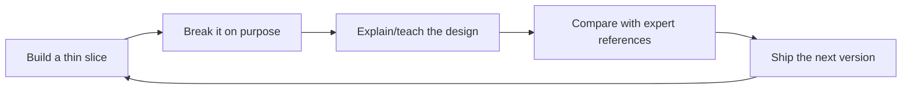

# Systems Design Speedrun

A build-first, teach-first systems design speedrun for people who want to start today.

This is not a reasonable study plan. It is an expertise-compression protocol: build a small system, break it on purpose, explain the tradeoff, compare against expert references, then ship the next version.

This repo is not a generic “learn anything” template. It is a systems-design workout plan built around recurring moves from interviews, design reviews, incident reviews, and real production systems:

1. **Frame the product** — users, use cases, non-goals, and hard constraints.
2. **Put numbers on it** — QPS, fanout, storage, bandwidth, cache size, partitions.
3. **Model the data and APIs** — entities, access patterns, indexes, consistency boundaries.
4. **Choose the baseline architecture** — request path, async path, storage, cache, queues, workers.
5. **Break the design on purpose** — hot keys, thundering herds, partial failure, retry storms, data loss, abuse, cost.
6. **Defend tradeoffs** — why this design, why not the obvious alternative, what changes at 10x.

## Start here: the direct outline

If you want to start today, follow this exact order:

1. [Day zero build](roadmap/00-day-zero-build.md) — build something small before you feel ready.
2. [Systems design playbook](concepts/systems-design-playbook.md) — use the reusable design moves while building.
3. [URL shortener kata](drills/url-shortener.md) or [rate limiter kata](drills/rate-limiter.md) — first full rep.
4. [Concrete resource map](resources/concrete-resource-map.md) — read only what answers your current design question.
5. [Design review rubric](artifact-templates/design-review-rubric.md) — score the design and find the next bottleneck.
6. [7-day core sprint](roadmap/01-7-day-core.md) — repeat the loop daily.

Then repeat with rate limiter, news feed, chat, webhook platform, and metrics ingestion.

## The exceptional loop

Short version: **build, break, teach, compare, ship again.**

Reading is not the first step. Reading is ammunition for the system you are already building.

## What makes this systems-design-specific

- **Numbers before architecture:** every serious design should include rough QPS, storage, bandwidth, and cache math.
- **Access patterns before databases:** pick storage by queries, writes, indexes, durability, and consistency needs.
- **Request path vs async path:** identify what must happen inline and what can move to queues/workers/streams.
- **Hot path vs cold path:** optimize the common path without losing operational repair paths.
- **Failure-mode thinking:** every design should name dependency failures, retries, backpressure, data loss risks, and user-visible impact.
- **Abuse and cost:** rate limits, quotas, bot behavior, noisy neighbors, and runaway spend are first-class constraints.
- **Tradeoff defense:** design docs should say what was rejected and what changes at 10x scale.

## What you should be able to do after the speedrun

After day zero, you should have a running toy system plus a design note. After 7 days, you should have 5-7 shipped reps: small systems or major revisions, each with pressure tests, tradeoffs, and teach-backs. After 30 days, you should have a public portfolio of systems, incident-style writeups, ADRs, and expert-comparison notes.

The aim is not to become “interview ready.” The aim is to compress the distance between naive builder and serious systems thinker as aggressively as possible.
