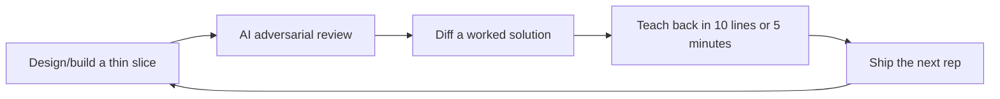

# Systems Design Speedrun

**Start here:** [do your first systems design rep in 30 minutes](start-here.md).

A build-first, teach-first systems design speedrun for people who want to start today.

This is not a reasonable study plan. It is an expertise-compression protocol: build a small system, break it on purpose, explain the tradeoff, compare against expert references, then ship the next version.

## The product is the loop

Short version: **build, review, diff, teach, ship again.**

Reading is not the first step. Reading is ammunition for the system you are already building.

## Fast path

One door in:

1. [Start here](start-here.md) — 25-minute URL shortener rep.
2. [AI design-review prompt](prompts/design-review-prompt.md) — get an adversarial review immediately.
3. [Worked URL shortener solution](drills/solutions/url-shortener.md) — diff against a reference answer.
4. [7-day core sprint](roadmap/01-7-day-core.md) — repeat daily with built-in revisits.
5. Track your own reps in `docs/drills/solutions/`.

After that, repeat with rate limiter, news feed, chat, webhook platform, and metrics ingestion.

## What makes this systems-design-specific

- **Numbers before architecture:** every serious design should include rough QPS, storage, bandwidth, and cache math.
- **Access patterns before databases:** pick storage by queries, writes, indexes, durability, and consistency needs.
- **Request path vs async path:** identify what must happen inline and what can move to queues/workers/streams.
- **Failure-mode thinking:** every design should name dependency failures, retries, backpressure, data loss risks, and user-visible impact.
- **Abuse and cost:** rate limits, quotas, bot behavior, noisy neighbors, and runaway spend are first-class constraints.
- **Tradeoff defense:** design docs should say what was rejected and what changes at 10x scale.

## What you should be able to do after the speedrun

After day zero, you should have a running toy system plus a design note. After 7 days, you should have 5-7 shipped reps: small systems or major revisions, each with pressure tests, tradeoffs, and teach-backs. After 30 days, you should have a public portfolio of systems, incident-style writeups, ADRs, and expert-comparison notes.

The aim is not to become “interview ready.” The aim is to compress the distance between naive builder and serious systems thinker as aggressively as possible.
