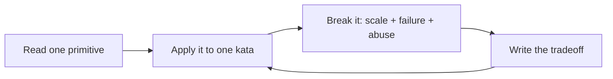

# Systems Design Speedrun

An opinionated, drill-based path for getting useful at systems design quickly.

This repo is not a generic “learn anything” template. It is a systems-design workout plan built around recurring moves from interviews and production reviews:

1. **Frame the product** — users, use cases, non-goals, and hard constraints.
2. **Put numbers on it** — QPS, fanout, storage, bandwidth, cache size, partitions.
3. **Model the data and APIs** — entities, access patterns, indexes, consistency boundaries.
4. **Choose the baseline architecture** — request path, async path, storage, cache, queues, workers.
5. **Break the design on purpose** — hot keys, thundering herds, partial failure, retry storms, data loss, abuse, cost.
6. **Defend tradeoffs** — why this design, why not the obvious alternative, what changes at 10x.

## Start here: the direct outline

If you have one week, follow this exact order:

1. [Speedrun map](roadmap/00-speedrun-map.md) — the mental model and skill tree.
2. [Systems design playbook](concepts/systems-design-playbook.md) — the reusable design moves.
3. [Concrete resource map](resources/concrete-resource-map.md) — what to read/watch/build first.
4. [7-day core sprint](roadmap/01-7-day-core.md) — daily drills with deliverables.
5. [URL shortener kata](drills/url-shortener.md) — first full pass.
6. [Design review rubric](artifact-templates/design-review-rubric.md) — score the design and find gaps.

Then repeat with rate limiter, news feed, chat, webhook platform, and metrics ingestion.

## The simplified loop

Short version: **learn one move, use it, break it, explain the tradeoff.**

## What makes this systems-design-specific

- **Numbers before architecture:** every serious design should include rough QPS, storage, bandwidth, and cache math.
- **Access patterns before databases:** pick storage by queries, writes, indexes, durability, and consistency needs.
- **Request path vs async path:** identify what must happen inline and what can move to queues/workers/streams.
- **Hot path vs cold path:** optimize the common path without losing operational repair paths.
- **Failure-mode thinking:** every design should name dependency failures, retries, backpressure, data loss risks, and user-visible impact.
- **Abuse and cost:** rate limits, quotas, bot behavior, noisy neighbors, and runaway spend are first-class constraints.
- **Tradeoff defense:** design docs should say what was rejected and what changes at 10x scale.

## What you should be able to do after the speedrun

After 7 days, you should be able to run a complete systems design conversation from requirements to tradeoffs. After 30 days, you should be able to handle common interview prompts and write pragmatic one-page designs. After 90 days, you should have a portfolio of build projects, ADRs, postmortems, and reviewed designs.
