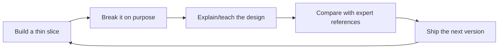

# Day Zero Build

Do not wait until you understand systems design to build a system.

Build a small, ugly version today. Then use systems design to explain why it breaks and how to evolve it.

## The 4-hour first rep

Pick one:

- URL shortener
- Rate limiter
- Webhook delivery service
- Tiny metrics ingestion API
- Chat room
- Job queue

In four hours, produce:

1. **A running toy implementation** — local is fine.
2. **A README design note** — requirements, API, data model, architecture.
3. **A pressure test** — load, failure, abuse, or cost.
4. **A tradeoff note** — what you chose, what breaks, what you would change at 10x.

The point is not production quality. The point is contact with reality.

## The exceptional learning loop

Short version: **build, break, teach, compare, ship again.**

Reading only enters the loop when it answers a live design question.

## Rules

1. **No passive study block longer than 30 minutes.** Read to unblock a design decision.
2. **Every concept must touch a system.** If you learn caching, add a cache. If you learn queues, enqueue work. If you learn SLOs, define one.
3. **Every build must be attacked.** Load test it, kill a dependency, duplicate a request, delay a worker, corrupt an input, or spike traffic.
4. **Every attack must become an artifact.** Write the failure mode, mitigation, and tradeoff.
5. **Teach every rep.** Explain the design in five minutes as if reviewing with a staff engineer.
6. **Compare against experts after attempting.** Read SRE, DDIA, AWS Builders Library, Jepsen, or production postmortems after your first design, not before.

## What to build first

### Option A: URL shortener

Why: simplest path from API/data model to cache, hot keys, analytics queues, abuse, and consistency.

Add pressure:

- 10k redirects/sec for one celebrity link.
- Database unavailable for 60 seconds.
- Bot creates millions of spam links.
- Analytics queue falls 30 minutes behind.

### Option B: Rate limiter

Why: forces distributed state, correctness, latency, fairness, and abuse thinking.

Add pressure:

- Multiple app servers race on the same user quota.
- NAT/shared IP causes false throttling.
- Redis is slow or unavailable.
- Attackers rotate identifiers.

### Option C: Webhook platform

Why: forces async delivery, retries, idempotency, DLQs, observability, and tenant isolation.

Add pressure:

- Customer endpoint times out.
- One tenant sends 100x more events than others.
- Delivery worker crashes after sending but before recording success.
- Replay/backfill must not duplicate side effects.

## The expert-compression protocol

To catch up fast, do not read expert material linearly. Use it as a comparison engine.

For each rep:

1. **Naive design:** write your first answer from memory.
2. **Reality attack:** identify where it fails under scale, latency, partial failure, abuse, and cost.
3. **Expert scan:** read only the relevant expert source.
4. **Delta note:** write what the expert knew that you missed.
5. **Second design:** update the system using the new principle.
6. **Teach-back:** explain the before/after in plain English.

The learning is in the delta between your first design and the expert-informed redesign.

## Minimum daily output

If you only have 60-90 minutes:

- 20 min: build or modify one thin slice.
- 15 min: break it or run a pressure test.
- 15 min: read one targeted expert source.
- 20 min: write/record the tradeoff and teach-back.

Do this daily for a week and you will learn more than from a month of passive notes.
