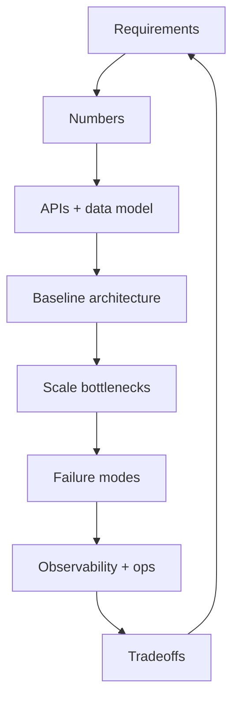

# Systems Design Speedrun Map

## The shortest useful mental model

Every systems design problem is a loop:

## The 8 highest-ROI skill trees

### 1. Problem framing

You need to clarify what matters before choosing technology.

- Users and use cases
- Functional requirements
- Non-functional requirements: latency, availability, consistency, durability, security, cost
- Read/write ratios
- Growth assumptions
- Explicit non-goals

### 2. Back-of-envelope sizing

Sizing turns vague designs into engineering decisions.

- Requests per second
- Peak-to-average ratio
- Storage growth
- Bandwidth
- Cache memory
- Fanout cost
- Partition count

### 3. Data and access patterns

Most architecture follows the data.

- Entities and relationships
- Query patterns
- Indexing
- Denormalization
- SQL vs document vs key-value vs graph
- Hot keys and skew
- Retention and archival

### 4. Scaling primitives

The core moves repeat everywhere.

- Load balancing
- Caching
- Replication
- Partitioning/sharding
- Queues and streams
- Async workers
- Rate limiting
- CDN and edge

### 5. Distributed systems judgment

This is the difference between diagrams and reality.

- Consistency models
- Consensus basics
- Idempotency
- Retries, timeouts, circuit breakers
- Backpressure
- Clock and ordering issues
- Exactly-once vs effectively-once

### 6. Reliability and operations

Production systems fail. Design assumes failure.

- SLOs and error budgets
- Health checks
- Graceful degradation
- Disaster recovery
- Rollbacks and deploy safety
- Monitoring, logs, traces, metrics
- Incident response and postmortems

### 7. Security, privacy, and abuse

Security belongs in the first design pass.

- Authentication and authorization
- Secrets management
- Encryption in transit and at rest
- Multi-tenancy isolation
- Abuse prevention
- Audit logs
- Data deletion and retention

### 8. Communication

The best design loses value if people cannot understand it.

- C4 diagrams
- Sequence diagrams
- ADRs
- One-page design docs
- Review rubrics
- Teach-back narratives

## What to deprioritize early

These can wait until you have the core moves:

- Memorizing vendor-specific product menus
- Over-optimizing CAP theorem slogans
- Exotic databases before basic indexing and partitioning
- Kubernetes internals before deployment and operability basics
- Microservices ideology before boundaries, data ownership, and operational cost
- Deep consensus implementation before understanding replication and failure tradeoffs

## One sentence test

For any concept, ask:

> What bottleneck, failure mode, or coordination problem does this concept solve, and what new cost does it introduce?
